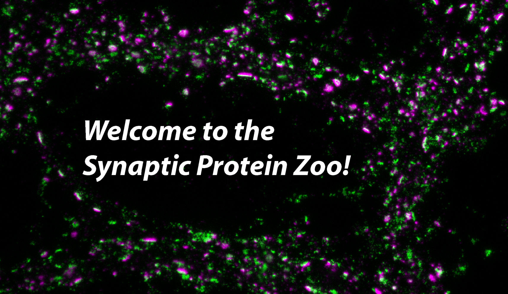

## About me

Coming from cancer research with focus on high throughput screening for drug development in the early years of my bachelor, I got fascinated during an internship with functional assays such as field recordings to study neuronal cell behaviour. I got hooked on doing my master in bio-photonics to learn functional imaging. During my Ph.D. I combined functional assays, super-resolution imaging and computational tools to quantitatively assess and explore synaptic protein organization and remodeling due to synaptic plasticity. Spured by my Ph.D. and postdoctoral experience my ambition is to overcome the current inability to directly link nanoscale protein organization to neuronal function impedes our understanding of fundamental cellular mechanisms and our capacity to alleviate misorganization in neurological disorders. 
Being a scientist for me is not a job, but a lifestyle in which I can be continuously curious and explore across fields, be it from neuroscience, photonics to machine learning. In another life, I would be a diplomat who writes fiction books on the side.

## Short Biography

I am a postdoctoral fellow in the [NeuroCyto team](https://www.neurocytolab.org/) at the Institute of NeuroPathoPhysiology (INP) in Marseille, France. Here I am study the role of actin/spectrin submembrane scaffold in axonal shaft exocytosis by combining live-cell and super-resolution microscopy.

Previously, I was a 1-year long postdoctoral fello in Biophotonics at Université Laval, Quebec, Canada. There I worked on the development of multimodal super-resolution imaging for live-cell imaging using machine learning. I completed my PhD in Biophotonics under the supervision of Paul De Koninck and Flavie Lavoie-Cardinal in 2021, where I was interested by the quantitative assessment of synaptic plasticity at the molecular scale with multimodal microscopy and computational tools. Before that I completed my master’s degree at Universisté Laval and Université Segalen, in France, and even earlier I did bachelor degree at the University of Perugia, in Italy.


## List of important publications

- [Activity-Dependent Remodeling of Synaptic Protein Organization Revealed by High Throughput Analysis of STED Nanoscopy Images](https://www.frontiersin.org/articles/10.3389/fncir.2020.00057/full#h5)

- [Resolution enhancement with a task-assisted GAN to guide optical nanoscopy image analysis and acquisition](https://www.nature.com/articles/s42256-023-00689-3)

- [A machine learning approach for online automated optimization of super-resolution optical microscopy](https://www.nature.com/articles/s41467-018-07668-y)

- [Conditional reduction of adult neurogenesis impairs bidirectional hippocampal synaptic plasticity](https://www.pnas.org/doi/abs/10.1073/pnas.1016928108?url_ver=Z39.88-2003&rfr_id=ori%3Arid%3Acrossref.org&rfr_dat=cr_pub++0pubmed)

## Would you like to see some of my Ph.D. data?

My data are used in the  **zooniervse project: The Synaptic Protein Zoo** to classify and segment the synaptic protein clusters.
Have a look! [Here](https://www.zooniverse.org/projects/reber199/synaptic-protein-zoo)



## Would you rather watch my talks?
[Optical and quantitative assessment of activity-dependent modulation of synaptic activity. UNIQUE Student Symposium online, USS2021 (2021)](https://www.youtube.com/watch?v=GW4bK8nY2Go&list=UUOoOsSZfudHl5vcUnCE3jrA&index=15)

[Detection of miniature synaptic calcium transient plasticity with positive unlabeled learning. UNIQUE Student Symposium online, USS2020 (2020) (starting from 25:00)](https://www.youtube.com/watch?v=_8nqyC4UUqo&t=1852s)

[CERVOTube 2020: How we learn, resolving nanoscale learning. 2020](https://www.youtube.com/watch?v=2O50ttUVgxg)


<!-- You can use the [editor on GitHub](https://github.com/wiesnertheresa/wiesnertheresa.github.io/edit/main/README.md) to maintain and preview the content for your website in Markdown files.

Whenever you commit to this repository, GitHub Pages will run [Jekyll](https://jekyllrb.com/) to rebuild the pages in your site, from the content in your Markdown files. -->

<!-- ### Markdown

Markdown is a lightweight and easy-to-use syntax for styling your writing. It includes conventions for

```markdown
Syntax highlighted code block

# Header 1
## Header 2
### Header 3

- Bulleted
- List

1. Numbered
2. List

**Bold** and _Italic_ and `Code` text

[Link](url) and 
```

For more details see [Basic writing and formatting syntax](https://docs.github.com/en/github/writing-on-github/getting-started-with-writing-and-formatting-on-github/basic-writing-and-formatting-syntax). -->
<!-- 
### Jekyll Themes

Your Pages site will use the layout and styles from the Jekyll theme you have selected in your [repository settings](https://github.com/wiesnertheresa/wiesnertheresa.github.io/settings/pages). The name of this theme is saved in the Jekyll `_config.yml` configuration file.

### Support or Contact

Having trouble with Pages? Check out our [documentation](https://docs.github.com/categories/github-pages-basics/) or [contact support](https://support.github.com/contact) and we’ll help you sort it out.
 --> 
